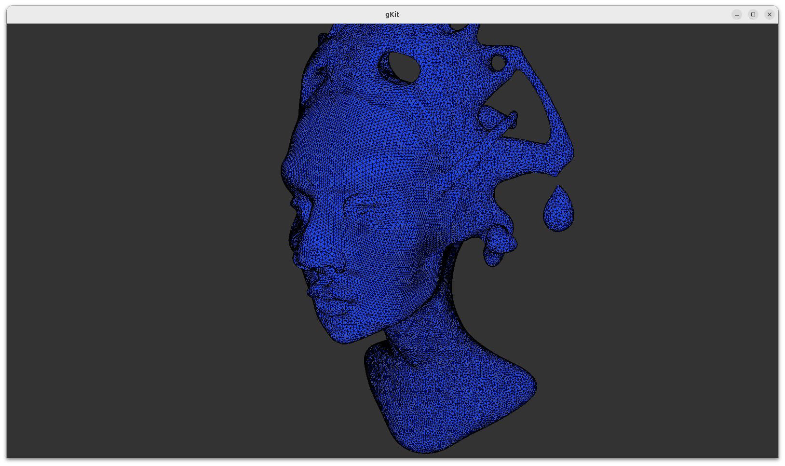
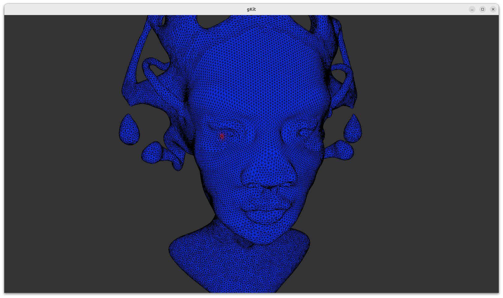
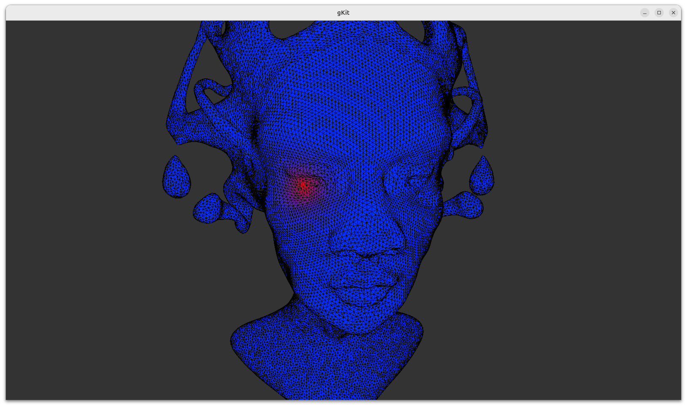
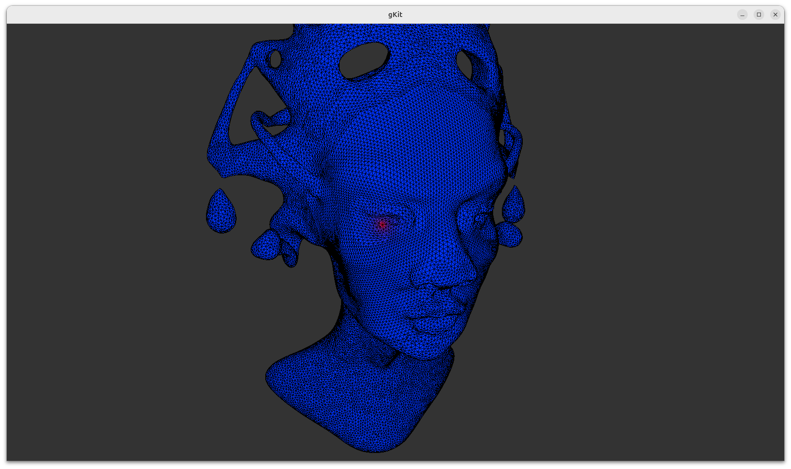
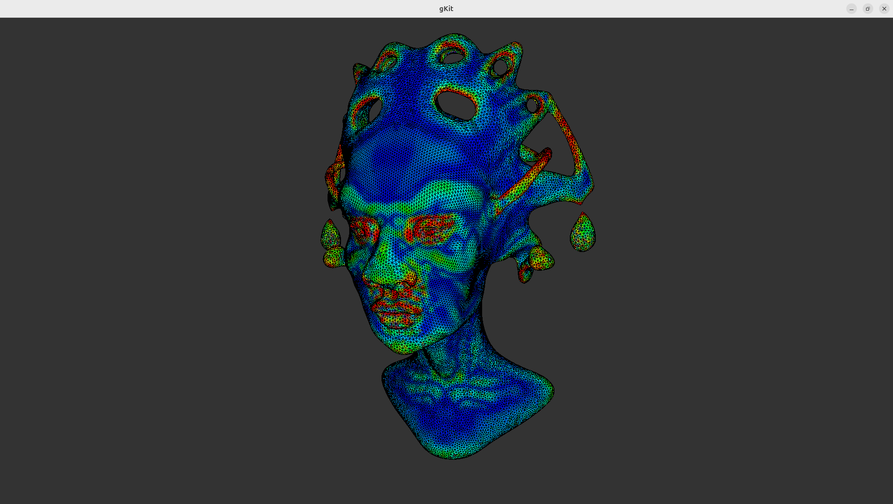
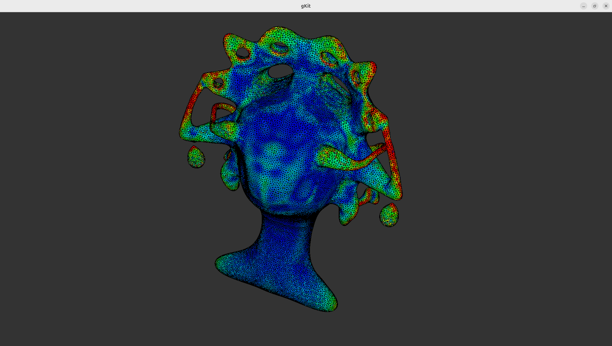

# Mesh Computational Geometry

This work comes from a practical assignment at École Centrale de Lyon, course *Meshes and Computational Geometry*.

## How to run the program

This assignment was completed using the gKit framework, studied during the practical sessions with Jean-Claude Iehl, for the visualization of results.

Before compiling, the following libraries may need to be installed:
```bash
sudo apt install libglew-dev libglew2.2
sudo apt install libsdl2-image-2.0-0 libsdl2-image-dev
sudo apt install libglfw3 libglfw3-dev
```

The program is compiled using the provided `Makefile`. From the project directory, run:
```bash
make
./main
```

At startup, the program prompts the user to choose between two modes:
```
1 - create meshes only
2 - load queen and open viewer
```

Choosing `1` creates and validates the three elementary meshes (tetrahedron, pyramid, and bounding box) and saves them as OFF files in the `data/` directory. This logic is preserved from TP1. Choosing `2` loads the mesh `data/queen.off` (any other OFF mesh can be used instead) and opens an interactive viewer.

Inside the viewer, three display modes can be switched using the keyboard:

- `1` — plain mesh rendering (blue fill, black edges)
- `2` — heat diffusion simulation with color visualization
- `3` — mean curvature estimation with HSV color visualization



---

## Implementation

### Cotangent Laplacian

The Laplacian of a scalar function $u$ defined on the mesh vertices is computed using the cotangent formula:

$$
(Lu)_i = \frac{1}{2A_i} \sum_j (\cot \alpha_{ij} + \cot \beta_{ij})(u_j - u_i)
$$

where $A_i$ is estimated as one third of the total area of the triangles incident to vertex $i$. The implementation iterates over all faces once: for each triangle, the cotangent at each vertex is computed and its contribution is accumulated symmetrically to both endpoints of the opposite edge, so each edge is handled in a single pass without requiring explicit neighbor traversal.

---

### Heat diffusion

Heat diffusion on the surface is simulated using the explicit Euler scheme:

$$
u(t + \delta t) = u(t) + \delta t \cdot \Delta u
$$

A single heat source is placed at vertex $0$, whose temperature is held constant at $1.0$ throughout the simulation by resetting it after every integration step. All other vertices are initialized to $0.0$. At each frame, one time step is performed using the cotangent Laplacian. The simulation evolves until a stationary state is reached, where the temperature distribution no longer changes.


*Heat diffusion at an early stage. The heat source at vertex 0 is visible as a small red region. The surrounding area is still cold.*


*Heat diffusion at a later stage. The heat has spread further across the surface,following the intrinsic geometry of the mesh independently of any parametrization.*

#### Color normalization

For visualization, the temperature field is mapped to RGB colors: hot regions appear red and cold regions appear blue. Initially, a linear normalization was used:

$$
t_{\text{norm}} = \frac{u_i - u_{\min}}{u_{\max} - u_{\min}}
$$

However, since most vertices have very small temperature values compared to the source, the linear mapping produced a nearly uniform blue mesh with only the source visible. To improve the visual result, a power normalization was adopted:

$$
t_{\text{norm}} = \left(\frac{u_i - u_{\min}}{u_{\max} - u_{\min}}\right)^{0.3}
$$

This compresses the lower end of the range, making the gradient visible across the entire surface. The simulation data itself is not affected — only the color mapping changes.


*Heat diffusion with linear normalization. Most of the mesh appears uniformly blue, with little visible gradient away from the source.*

---

### Mean curvature

The mean curvature at each vertex is estimated by applying the Laplacian operator to each coordinate function. For a vertex $s$ with position $(x, y, z)$, the Laplacian vector $\Delta s = (\Delta x, \Delta y, \Delta z)$ satisfies $\Delta s = 2Hn$, where $H$ is the mean curvature and $n$ is the surface normal. The scalar curvature is thus:

$$
H = \frac{\|\Delta s\|}{2}
$$

In practice, $\Delta x$, $\Delta y$, and $\Delta z$ are each computed by a separate call to `compute_laplacian`, passing the corresponding coordinate of each vertex as the scalar function.

The curvature field is computed once when mode `3` is activated and does not change over time. For visualization, curvature values are normalized and encoded in HSV coordinates. The hue ranges from blue (low curvature, flat regions) to red (high curvature, sharp features). Saturation and value are fixed at $1.0$.

To handle outliers in the curvature distribution (range up to 320), a percentile clamp is applied: only values between the 5th and 95th percentiles are used for normalization. The displayed range for the queen mesh is $[0.88, 69.92]$.



*Mean curvature visualization of the queen mesh. Flat regions such as the forehead and cheeks appear blue, while sharp features such as the ears, lips, and hair details appear red.*

---

### Visualization with gKit

Visualization was implemented using the gKit framework through an interactive viewer class derived from `AppCamera`.

A first approach using the gKit `Mesh` class was initially implemented. However, this required calling `mesh.release()` and `create_buffers()` at every color update, which caused repeated GPU memory allocation and deallocation — up to 12 times per second during heat diffusion. This also produced unwanted log messages from the gKit internals. A manual OpenGL approach was therefore adopted instead.

Two separate vertex buffer objects are maintained:

- `vbo_position` — stores vertex positions, allocated once with `GL_STATIC_DRAW`   since geometry never changes.
- `vbo_color` — stores per-vertex RGBA colors, allocated with `GL_DYNAMIC_DRAW` and updated at runtime using `glBufferSubData`, which uploads only the color data without touching the position buffer.

Both buffers are bound in a single VAO. The shader `mesh_color.glsl` uses a uniform integer flag `useVertexColor` to switch between two rendering modes: when set to `0`, a constant `baseColor` is used (mode `1`, plain blue mesh); when set to `1`, per-vertex colors from the color buffer are used (modes `2` and `3`). Each frame is rendered in two passes: a filled polygon pass for the surface, followed by an edge pass using `GL_POLYGON_OFFSET_LINE` to avoid z-fighting between the fill and the edges.

For the heat diffusion mode, the color buffer is updated every five frames. For the curvature mode, it is computed once and never updated again. In both cases, only the color buffer is reuploaded — the position buffer remains untouched throughout the entire session.